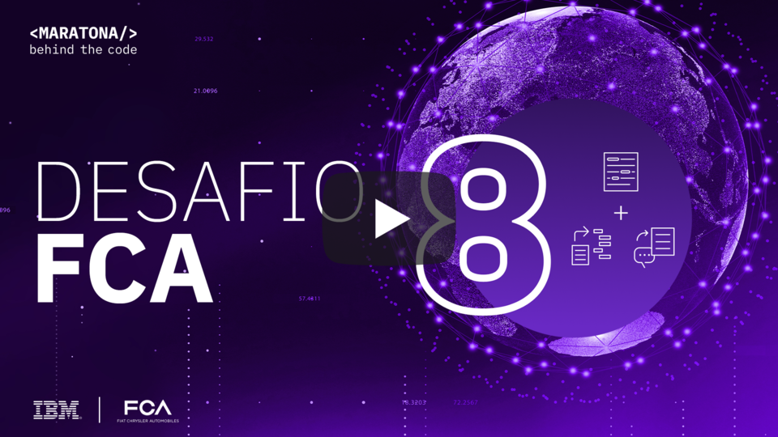
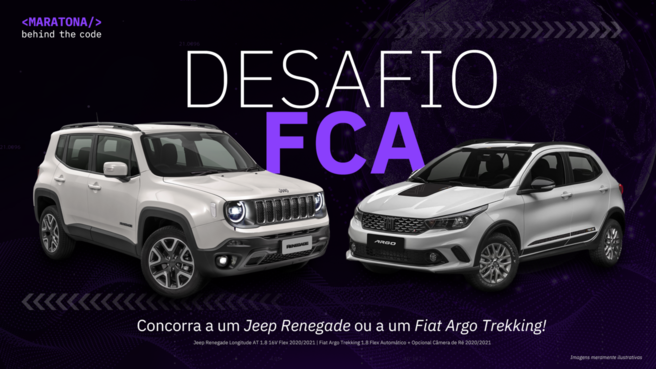
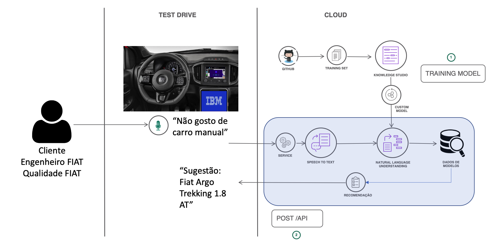
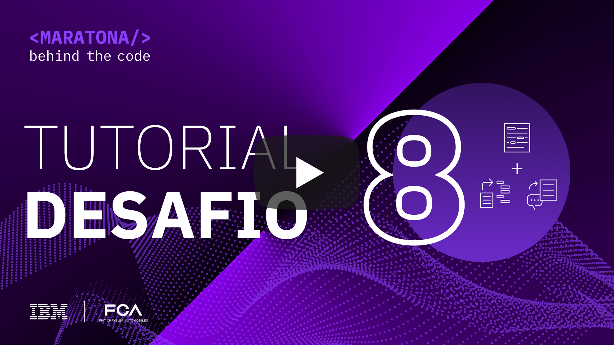

[](https://cloud.ibm.com)
<a href="https://discord.gg/2NRPpcU">
</a>

# Desafio 08 | Fiat Chrysler Automobiles

- [1. Sobre a FCA](#1-sobre-a-fca)
  - [1.1. Introdução](#11-introducao)
  - [1.2. Premiação](#12-premiacao)
- [2. Desafio de negócio](#2-desafio-de-negócio)
- [3. Objetivo](#3-objetivo)
- [4. Tecnologias aplicadas](#4-tecnologias-aplicadas)
- [5. Desenvolvimento](#5-desenvolvimento)
  - [5.1. Parte 1: Processamento de linguagem natural](#51-parte-1--processamento-de-linguagem-natural)
  - [5.2. Parte 2: Integração e deploy de uma API HTTP](#51-parte-2--integração-e-deploy-de-uma-api-http)
- [6. Submissão](#6-submissão)
- [7. Resumo das tarefas](#7-resumo-das-tarefas)
- [8. Sobre a avaliação](#6-sobre-a-avaliação)

## Para te ajudar

- [Material de Apoio](#material-de-apoio)
- [License](#license)

## 1. Sobre a FCA

### 1.1. Introdução

A Fiat Chrysler Automobiles (FCA) desenvolve, projeta, fabrica e comercializa automóveis, veículos comerciais leves, componentes e sistemas de produção.
Com presença comercial em mais de 135 países, o Grupo opera 102 fábricas e 46 Centros de Pesquisa & Desenvolvimento no mundo.
As marcas automotivas da FCA incluem Abarth, Alfa Romeo, Chrysler, Dodge, Fiat, Fiat Professional, Jeep, Lancia, Maserati e RAM. Os negócios do Grupo também incluem Mopar (peças e serviços automotivos), Comau (sistemas de produção) e Teksid (ferro e fundidos).
O Grupo oferece ainda serviços financeiros em apoio ao varejo e concessionárias por meio de suas subsidiárias, joint ventures e acordos comerciais com instituições especializadas.
No Brasil é uma empresa que fatura R\$ 46 bi e tem aproximadamente 24 mil funcionários.

<div align="center">
    <a href="https://www.youtube.com/watch?v=p7Lo6I-MQ80">
       
    </a>
</div>

### 1.2. Premiação

<div align="center">
       
</div>

**Vencedor deste desafio**
O vencedor deste desafio, com maior pontuação e que atenda aos critérios do regulamento da Maratona, ganhará do Grupo FCA **_01 veículo Fiat Argo Trekking 1.8 Flex Automático + Opcional Câmera de Ré 2020/2021_**.

**Vencedor da Maratona Behind The Code**
O primeiro lugar no ranking geral da Maratona, ganhará do Grupo FCA **_01 veículo Jeep Renegade Longitude AT 1.8 16V Flex 2020/2021_**.

**Atenção**: A entrega dos prêmios não poderá ser cumulativa à mesma pessoa, ou seja, a pessoa ganhadora no ranking geral não poderá ser a mesma ganhadora do desafio do Grupo FCA. Nesta hipótese, o prêmio deste desafio será repassado à pessoa na segunda posição do desafio do Grupo FCA.

## 2. Desafio de negócio

O Grupo FCA, em busca constante de melhoria de qualidade de seus serviços, bem como dar a melhor experiência para seus clientes, busca soluções tecnológicas, através do reconhecimento de voz, para capturar feedbacks e comentários de forma automática, e através de AI, analisar sentimento, e identificar partes relevantes do produto nesta experiência, como por exemplo, sobre motor, desempenho, acabamento, consumo, etc, e assim poder fazer recomendações e melhorar a experiência do usuário de forma evolutiva. Esta solução poderá ser utilizada durante a experiência de seus clientes, teste de engenharia e qualidade.

## 3. Objetivo

Como objetivo principal, espera-se ter um dispositivo inteligente que é capaz de compreender sugestões de um motorista que dirige um veículo Fiat ou Jeep. Esse dispositivo será capaz de analisar o contexto do que está sendo dito em linguagem natural por um motorista, realizar análise de sentimento, e ao final ser capaz de sugerir outros veículos para test-drive ou review, além de sintetizar informações valiosas para equipes de engenharia responsáveis por melhorias nos automóveis.

Neste desafio serão utilizados diversos serviços da IBM Cloud, como o Watson Speech to Text (STT) para a transcrição de áudio, e o Watson Natural Language Understanding (NLU) para extração de entidades textuais e análise de sentimento. As falas do motorista deverão ser processadas em áudio e texto, e as entidades textuais pertinentes a identificação de componentes, ou critérios de avaliação dos veículos, deverão ser anotadas por um modelo de IA. Esses serviços serão todos integrados por meio de um framework ou tecnologia de escolha livre pelo participante, que além do modelo treinado também entregará uma API REST como solução.

<div align="center">
       
</div>

## 4. Tecnologias aplicadas

Para este desafio serão utilizados os seguintes serviços da IBM Cloud:

- [Watson Knowledge Studio](https://cloud.ibm.com/catalog/services/knowledge-studio)

- [Watson Natural Language Understanding](https://cloud.ibm.com/catalog/services/natural-language-understanding)

- [Watson Speech-to-Text](https://cloud.ibm.com/catalog/services/speech-to-text)

Veja o vídeo-tutorial abaixo com dicas e instruções sobre como utilizar as principais tecnologias envolvidas:

<div align="center">
    <a href="https://www.youtube.com/watch?v=Nqyd5rJ0KJU">
       
    </a>
</div>

## 5. Desenvolvimento

O desafio da FCA consiste na criação de um serviço REST capaz de receber como parâmetro de entrada um áudio ou um texto e retornar uma sugestão de veículo e as entidades encontradas, bem como o sentimento associado a cada uma delas. O desafio é dividido então em duas partes principais:

- Parte 1: Processamento de linguagem natural
- Parte 2: Integração e deploy de uma API HTTP

Leia as instruções abaixo com muita atenção para evitar erros na sua solução.

### 5.1. Parte 1: Processamento de linguagem natural

Primeiramente você deverá criar um modelo anotador de linguagem natural no Watson Knowledge Studio para extrair entidades relacionadas aos veículos. Para tanto foi disponibilizado um [conjunto de documentos](./doc/source/dataset) que deverão ser anotados manualmente no WKS para a criação de seu modelo especializado.

Seu modelo deve conter as seguintes **entidades** (esse conjunto de entidades é chamado de "Type System" no WKS):

<div align="center">
  <table>
  <thead>
    <tr>
      <th>Nomes esperados para as entidades</th>
    </tr>
  </thead>
  <tbody>
    <tr>
      <td>ACESSORIOS</td>
    </tr>
    <tr>
      <td>CONFORTO</td>
    </tr>
    <tr>
      <td>CONSUMO</td>
    </tr>
    <tr>
      <td>DESEMPENHO</td>
    </tr>
    <tr>
      <td>DESIGN</td>
    </tr>
    <tr>
      <td>MANUTENCAO</td>
    </tr>
    <tr>
      <td>MODELO</td>
    </tr>
    <tr>
      <td>SEGURANCA</td>
    </tr>
  </tbody>
  </table>
</div>

_Atenção aos nomes pois o validador buscará exatmente por essas entidades, da maneira como estão escritas acima._

Cada uma dessas entidades englobam aspectos relativos a veiculos automotores. Para tornar mais claro o que essas entidades representam segue a tabela abaixo com alguns exemplos de entidades e o trecho de texto que deve ser marcado.

<div align="center">
  <table align="center">
  <thead>
    <tr>
      <th>Entidade</th>
      <th>Exemplo de marcação</th>
    </tr>
  </thead>
  <tbody>
    <tr>
      <td>ACESSORIOS</td>
      <td>Ar condicionado, Porta treco<br></td>
    </tr>
    <tr>
      <td>CONFORTO</td>
      <td>Banco de couro, suspensão</td>
    </tr>
    <tr>
      <td>CONSUMO</td>
      <td>10KM/L</td>
    </tr>
    <tr>
      <td>DESEMPENHO</td>
      <td>Motor, arrancar</td>
    </tr>
    <tr>
      <td>DESIGN</td>
      <td>4 portas</td>
    </tr>
    <tr>
      <td>MANUTENCAO</td>
      <td>Manutençao, mão de obra mecânica</td>
    </tr>
    <tr>
      <td>MODELO</td>
      <td>FIAT Argo 1.8</td>
    </tr>
    <tr>
      <td>SEGURANCA</td>
      <td>Freio</td>
    </tr>
  </tbody>
  </table>
</div>

Uma vez com os documentos marcados será necessário realizar o treinamento do modelo com base nas suas anotações manuais. Uma vez com o modelo treinado você deverá encapsulá-lo em uma instância do Natural Language Understanding (NLU). Todo o procedimento de marcação, encapsulamento e teste do seu modelo do WKS você econtra no [vídeo](#41-tecnologia-do-desafio) da seção acima.

O NLU é um serviço que aceita somente texto como entrada, porém para esse desafio é esperado como entrada possível um arquivo de áudio, ou seja, será necessário fazer a transcrição do áudio para texto e em seguida utilizar o NLU e extrair as entidades.

Portanto, o segundo passo no desenvolvimento da solução será a instanciação de um serviço de transcrição de áudio e integração de todas essas ferramentas de processamento de linguagem natural em uma API.

### 5.2. Parte 2: Integração e deploy de uma API HTTP

Sua API deve ser capaz de receber um requisição `POST`, cujo conteúdo seja `mutipart/form-data` que receberá como entrada um aquivo de áudio no formato `FLAC` e um formulário indicando sobre qual carro é o comentário, ou um formulário com um texto e um carro a qual o texto se refere.

Serão então duas possíveis entradas na API que será desenvolvida:

- 1: Um arquivo de áudio em formato FLAC + uma string com o nome do veículo tratado;
- 2: Uma string contendo comentários sobre um automóvel + outra string contendo o nome do veículo tratado.

Abaixo segue um exemplo de como a requisição HTTP chegará no serviço desenvolvido quando o arquivo de áudio estiver presente:

```HTTP
POST /NOME_DO_SEU_CAMINHO HTTP/1.1
Host: ENDERECO_DO_SEU_HOST
Content-Type: multipart/form-data; boundary=----WebKitFormBoundary8KJjbjbjHVHYY39

----WebKitFormBoundary8KJjbjbjHVHYY39
Content-Disposition: form-data; name="car"

uno
----WebKitFormBoundary8KJjbjbjHVHYY39
Content-Disposition: form-data; name="audio"; filename="audio1.flac"
Content-Type: multipart/form-data;

(data)
----WebKitFormBoundary8KJjbjbjHVHYY39
```

Exemplo da requisição HTTP quando somente o formulário com texto e carro estiverem presentes:

```HTTP
POST /NOME_DO_SEU_CAMINHO HTTP/1.1
Host: ENDERECO_DO_SEU_HOST
Content-Type: multipart/form-data; boundary=----WebKitFormBoundary721JSjgwfHG8RtH

----WebKitFormBoundary721JSjgwfHG8RtH
Content-Disposition: form-data; name="car"

uno
----WebKitFormBoundary721JSjgwfHG8RtH
Content-Disposition: form-data; name="text"

Carro bom carro legal
----WebKitFormBoundary721JSjgwfHG8RtH
```

Você deverá processar o áudio de entrada com o Watson STT (ou outro serviço de transcrição de sua preferência), e posteriormente processar o texto transcrito com o Watson NLU.

Já a saída da sua API deve ser um documento JSON com a estrutura exemplo abaixo:

```JSON
{
  "recommendation": "ARGO",
  "entities": [
      {
          "entity": "ACESSORIOS",
          "sentiment": -0.890016,
          "mention": "Ar condicionado"
      },
      {
          "entity": "CONSUMO",
          "sentiment": -0.001004,
          "mention": "8Km/L"
      }
  ]
}
```

Caso seu modelo do NLU não encontre entidade nenhuma para fazer a analise necessária, sua API deve retornar um JSON no seguinte formato:

```JSON
{
  "recommendation": "",
  "entities": []
}
```

A "recomendação" de veículo (variável `recommendation` na saída da API) deverá ser um dos seguintes valores tabelados abaixo (escritos exatamente como apresentados):

<div align="center">
  <table>
  <thead>
    <tr>
      <th>Nomes esperados para os veículos recomendados</th>
    </tr>
  </thead>
  <tbody>
    <tr>
      <td>TORO</td>
    </tr>
    <tr>
      <td>DUCATO</td>
    </tr>
    <tr>
      <td>FIORINO</td>
    </tr>
    <tr>
      <td>CRONOS</td>
    </tr>
    <tr>
      <td>FIAT 500</td>
    </tr>
    <tr>
      <td>MAREA</td>
    </tr>
    <tr>
      <td>LINEA</td>
    </tr>
    <tr>
      <td>ARGO</td>
    </tr>
    <tr>
      <td>RENEGADE</td>
    </tr>
  </tbody>
  </table>
</div>

Além disso, a recomendação deve obedecer algumas regras:

- Não deve haver recomendação de veículo se o sentimento geral identificado nas entidades reconhecidas pelo NLU for positivo;
- O mesmo veículo passado no parâmetro de entrada não pode ser sugerido (ex: a API não pode recomendar o MAREA se o Marea for o carro trabalhado no review/comentário).
- A recomendação do veículo deve ser baseda na entidade com sentimento mais negativo, por exemplo: O NLU extraiu duas entidades do tipo `DESEMPENHO` que no total possuem sentimento de -0.5 e uma do tipo `CONSUMO` com sentimento de -0.8, nesse caso a sugestão deve ser um carro com consumo melhor.
- Em caso de empate no valor dos sentimentos ou caso a diferença absoluta entre os mais negativos seja menor que 0.1, a tebela de prioridades abaixo deve ser utilizada, onde a prioridade 1 é a mais prioritária e a 7 a menor. Por exemplo, o NLU extraiu uma entidade do tipo `SEGURANCA` que no total possuí sentimento de -0.6 e uma do tipo `CONSUMO` com sentimento de -0.65. Como a diferença absoluta entre elas é menor do que 0.1, deve ser sugerido um veículo com boa avaliação seguindo a tabela de prioridades.
- O participante deverá escolher quais veículos se encaixam em cada prioridade, baseando-se nos exemplos de review fornecidos como conjunto de treino.

<div align="center">
  <table>
  <thead>
    <tr>
      <th>Prioridade</th>
      <th>Entidade</th>
    </tr>
  </thead>
  <tbody>
    <tr>
      <td>1</td>
      <td>SEGURANCA</td>
    </tr>
    <tr>
      <td>2</td>
      <td>CONSUMO</td>
    </tr>
    <tr>
      <td>3</td>
      <td>DESEMPENHO</td>
    </tr>
    <tr>
      <td>4</td>
      <td>MANUTENCAO</td>
    </tr>
    <tr>
      <td>5</td>
      <td>CONFORTO</td>
    </tr>
    <tr>
      <td>6</td>
      <td>DESIGN</td>
    </tr>
    <tr>
      <td>7</td>
      <td>ACESSORIOS</td>
    </tr>
  </tbody>
  </table>
</div>

A lógica de programação para a realização dessas tarefas é parte do desafio e deve ser implementada pelo participante. Na seção [Material de Apoio](#material-de-apoio) são apresentadas as referências de API dos serviços Watson STT e Watson NLU, que possuem exemplos e snippets de código em várias linguagens mostrando como utilizar os serviços da IBM Cloud diretamente com código. Neste repositório também se encontra a especificação da API desejada como solução (no padrão do Swagger, ou Open-API): [api.yaml](./doc/source/api.yaml). No dataset fornecido neste repositório também é dado um arquivo de áudio em formato FLAC para você testar sua API.

Uma vez que você estiver confortável com sua solução, você precisará expor a API em alguma rota pública para que possamos testá-la. Recomendamos que você utilize a Cloud Foundry na IBM para hospedar sua aplicação, [aqui está um repositório com um exemplo](https://github.com/danitrod/cloud-foundry-example), e abaixo um vídeo de como realizar esse deploy:

<div align="center">
    <a href="https://www.youtube.com/watch?v=PFGPgO3YZ4c">
       
    </a>
</div>

## 6. Submissão

Primeiramente, a submissão do **Desafio 8 - FCA** ficará disponível apenas na quarta-feira, dia 16 de setembro. Use o tempo disponível para implementar e testar bem sua solução, pois neste desafio só será permitida uma única chance válida. **Também não serão enviados e-mails de feedback com as estrelas**, apenas um alerta em caso de eventual falha na pontuação da sua submissão - assim como nos outros desafios, se ocorrer um erro no processo de pontuação, sua chance não é consumida e você pode submeter novamente.

Para realizar a submissão você deverá acessar a seguinte página Web: [https://fca.maratona.dev](https://fca.maratona.dev) e preencher o formulário disponibilizado. Após clicar no botão `Submeter`, você deverá clicar no link de confirmação que será enviado via e-mail pela organização.

### 7. Resumo das tarefas

1. Baixar o conjunto de [amostras de texto fornecido](./doc/source/dataset) para treinamento do WKS.
2. Criar uma instância do Watson Knowledge Studio.
3. Criar uma instância do Natural Language Understanding.
4. Usar o WKS para criar um modelo de anotação textual especializado, utilizando o dataset disponibilizado.
5. Encapsular o modelo criado anteriormente com o Watson Natural Language Understanding.
6. Criar uma instância do serviço Watson Speech-to-Text (STT).
7. Construir uma API integrando o STT e o NLU, que seja capaz de receber audio ou texto como entrada, e devolver uma recomendação de veículo e as entidades textuais extraídas juntamente com o sentimento associado a cada uma delas.
8. Analisar e testar **bem** a sua solução com o conjunto de [amostras de texto](./doc/source/dataset) e [amostras de áudio](./doc/source/dataset) fornecidos.
9. Submeter sua solução em [https://fca.maratona.dev](https://fca.maratona.dev) - neste desafio você terá apenas 1 chance de submissão.

## 8. Sobre a avaliação

O sistema testará se a sua API é capaz de realizar o processamento pedido e se a resposta dela está dentro do esperado, bem como se o seu modelo no NLU está extraindo as entidades corretamente e qual a confiança que ele tem nas extrações. Sua nota será uma função que relaciona a resposta da API com a confiaça das entidades extraídas diretamente no seu NLU.

## Material de apoio

- [Watson Knowledge Studio Docs](https://cloud.ibm.com/docs/watson-knowledge-studio?topic=watson-knowledge-studio-wks_tutintro)
- [Natural Language Understanding Docs](https://cloud.ibm.com/docs/natural-language-understanding)
- [Natural Language Understanding API REF](https://cloud.ibm.com/apidocs/natural-language-understanding)
- [IBM Speech To Text Docs](https://cloud.ibm.com/docs/speech-to-text)
- [IBM Speech To Text API REF](https://cloud.ibm.com/apidocs/speech-to-text)
- [Aplicações Cloud Foundry na IBM Cloud](https://youtu.be/oUpqXxmr6oU)
- [IBM Cloud Functions](https://cloud.ibm.com/docs/openwhisk?topic=openwhisk-getting-started)

Você também pode acessar o discord oficial da Maratona 2020 para realizar perguntas e/ou interagir com outros participantes: [Discord](https://discord.gg/2NRPpcU).

## License

Copyright 2020 Maratona Behind the Code

Licensed under the Apache License, Version 2.0 (the "License");
you may not use this file except in compliance with the License.
You may obtain a copy of the License at

       http://www.apache.org/licenses/LICENSE-2.0

Unless required by applicable law or agreed to in writing, software
distributed under the License is distributed on an "AS IS" BASIS,
WITHOUT WARRANTIES OR CONDITIONS OF ANY KIND, either express or implied.
See the License for the specific language governing permissions and
limitations under the License.
